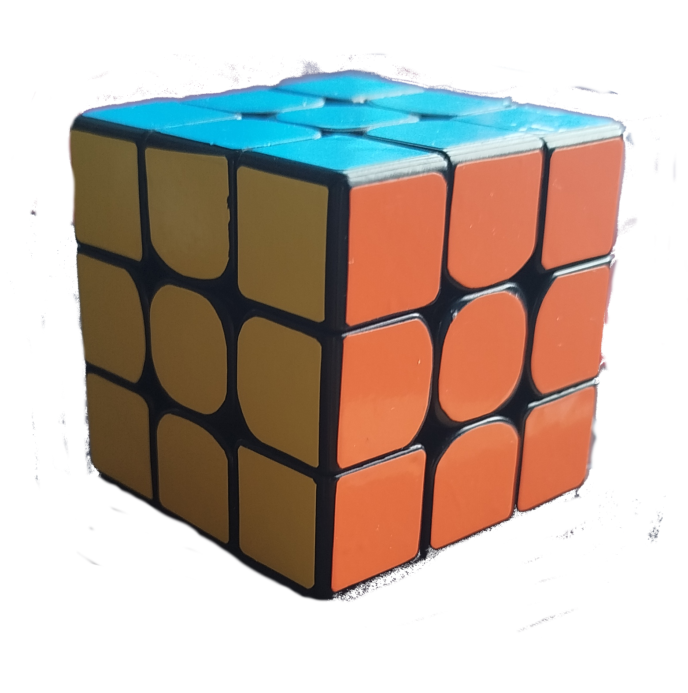
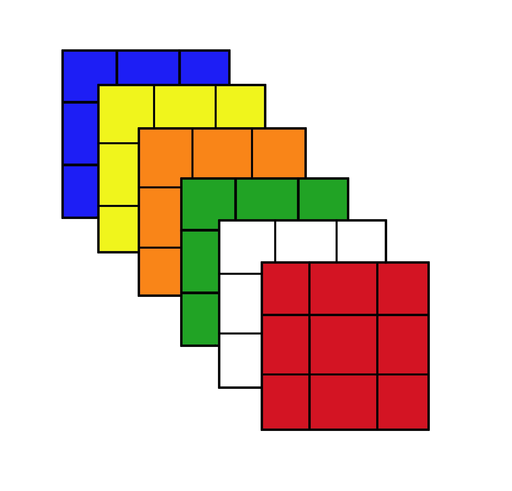
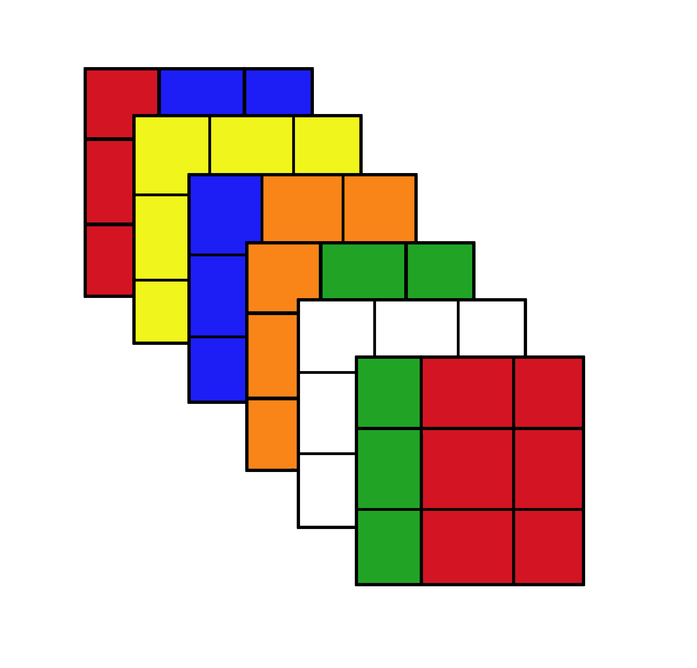

# Arduino-RubikSolver

## Run

For the android App, download it to your smartphone and it will work, hopefully.

Grab to arduino folder, open it with Arduino IDE and plug it to the board.  
Parent directory must be named "a_constants", do not change it.  
You need to install Adafruit PWM servo driver and can easly do that in Arduino IDE library manager.  

## Solving Method

I approached this problem in the most naive way possible. Since I already know how to solve a rubiks cube using the [CFOP method](https://jperm.net/3x3/cfop), I figured the same logic could be translated into code. After all, even for a human it doesn't require too much memory or processing power to compute, so the arduino could probably handle it.   

Just like a real cube is a 6 faces puzzle with 9 stickers on each face, I can mimic that by creating a 3x3x6 array to hold the colors of each sticker for all the 6 faces. 
Just like each sticker on a physical cube occupies a specific position, in my program each sticker corresponds to an integer value representing its color, stored in memory within my variable `Rubik`.

| Real cube      | Cube representation in code      |
| ----- | ----- |
|     |  |

When a face turns, the stickers are moved around in a predefined way and the colors on each face changes. I can also simulate that behaviour by swapping the color values across different array indexes. These rotations are defined in `Rubik.ino` file.

| Real cube with face roteted     | Cube representation in code      |
| ----- | ----- |
|     |  |

Based on the colors at specific positions at a given moment, I can decide which CFOP algorithm to apply.

